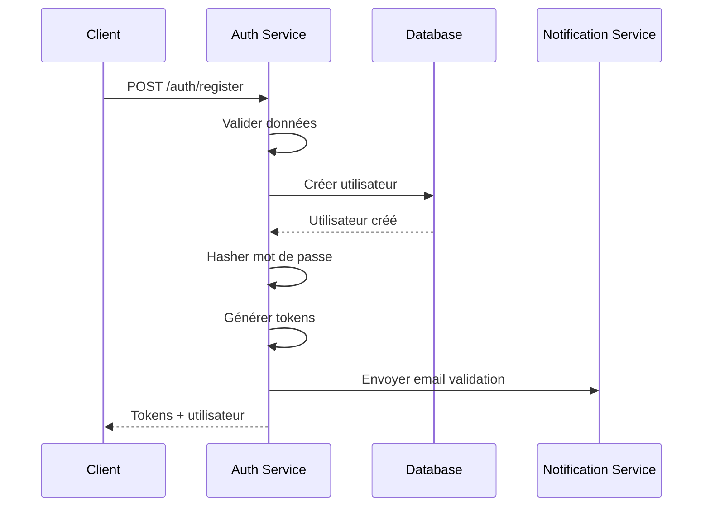
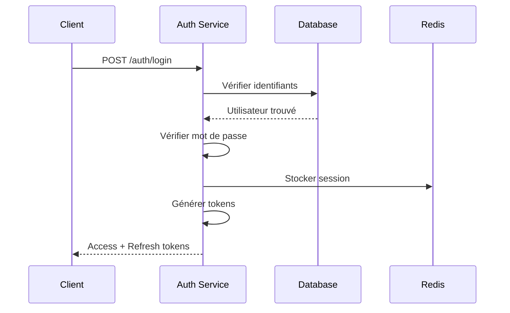
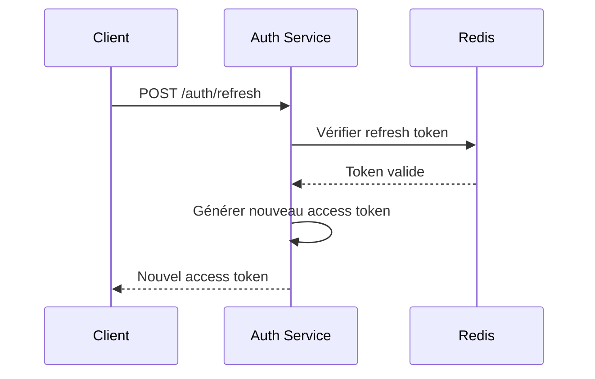

# 🔐 AUTH SERVICE - DOCUMENTATION TECHNIQUE

## 🎯 Vue d'ensemble

Le **Auth Service** est le service central d'authentification et d'autorisation de la plateforme Event Planner SaaS. Il gère les identités, les permissions, les rôles et les sessions de manière sécurisée.

## 🏗️ Architecture Technique

### Stack Technique
```
┌─────────────────────────────────────────┐
│            AUTH SERVICE                  │
├─────────────────────────────────────────┤
│ 📦 Node.js + Express.js                  │
│ 🗄️ PostgreSQL (utilisateurs, rôles)        │
│ 🔴 Redis (sessions, cache)               │
│ 🔐 JWT (tokens)                           │
│ 🛡️ Bcrypt (hashage mots de passe)         │
│ 📧 SMTP/SMS (notifications)               │
│ 📊 Winston (logs)                        │
└─────────────────────────────────────────┘
```

### Architecture en couches
```
┌─────────────────────────────────────────┐
│              API LAYER                   │
│  ┌─────────────┬─────────────────────────┐   │
│  │   Routes    │     Controllers        │   │
│  │  (Express)   │    (Business Logic)     │   │
│  └─────────────┴─────────────────────────┘   │
├─────────────────────────────────────────┤
│             SERVICE LAYER                 │
│  ┌─────────────┬─────────────────────────┐   │
│  │   Services   │     Repositories       │   │
│  │  (Core Logic)│   (Data Access)        │   │
│  └─────────────┴─────────────────────────┘   │
├─────────────────────────────────────────┤
│              DATA LAYER                   │
│  ┌─────────────┬─────────────────────────┐   │
│  │ PostgreSQL  │        Redis            │   │
│  │ (Primary)   │      (Cache)            │   │
│  └─────────────┴─────────────────────────┘   │
└─────────────────────────────────────────┘
```

## 🔐 Stratégie d'Authentification

### 1. JWT (JSON Web Tokens)
```javascript
// Structure du token
{
  "header": {
    "alg": "HS256",
    "typ": "JWT"
  },
  "payload": {
    "sub": "user_id",
    "email": "user@example.com",
    "role": "organizer",
    "permissions": ["events:create", "events:read"],
    "iat": 1640995200,
    "exp": 1640998800,
    "iss": "auth-service",
    "aud": "event-planner"
  }
}
```

### 2. Double Token Pattern
- **Access Token** : Court durée (15 minutes) pour les requêtes API
- **Refresh Token** : Longue durée (7 jours) pour le renouvellement

### 3. Sécurité des Tokens
- **Signature HMAC-SHA256** : Intégrité du token
- **Rotation automatique** : Renouvellement transparent
- **Blacklist** : Révocation immédiate des tokens compromis

## 🛡️ RBAC (Role-Based Access Control)

### Hiérarchie des Rôles
```
SUPER_ADMIN (Niveau 5)
├── ADMIN (Niveau 4)
│   ├── ORGANIZER (Niveau 3)
│   │   ├── USER (Niveau 2)
│   │   └── GUEST (Niveau 1)
│   └── MODERATOR (Niveau 3)
└── SYSTEM (Niveau 5)
```

### Permissions Granulaires
```javascript
// Structure des permissions
const PERMISSIONS = {
  // Événements
  'events:create': ['admin', 'organizer'],
  'events:read': ['admin', 'organizer', 'user', 'guest'],
  'events:update': ['admin', 'organizer'],
  'events:delete': ['admin'],
  
  // Utilisateurs
  'users:create': ['admin'],
  'users:read': ['admin', 'user'],
  'users:update': ['admin', 'user'],
  'users:delete': ['admin'],
  
  // Système
  'system:monitor': ['super_admin', 'system'],
  'system:config': ['super_admin']
};
```

### Middleware RBAC
```javascript
// Middleware de vérification des permissions
const rbacMiddleware = (requiredPermission) => {
  return (req, res, next) => {
    const user = req.user;
    const hasPermission = user.permissions.includes(requiredPermission);
    
    if (!hasPermission) {
      return res.status(403).json({
        error: 'Insufficient permissions',
        required: requiredPermission,
        userRole: user.role
      });
    }
    
    next();
  };
};
```

## 🔄 Flux d'Authentification

### 1. Inscription (Register)


### 2. Connexion (Login)


### 3. Renouvellement (Refresh)


## 🗄️ Base de Données

### Schéma Principal
```sql
-- Utilisateurs
CREATE TABLE users (
    id BIGSERIAL PRIMARY KEY,
    email VARCHAR(255) UNIQUE NOT NULL,
    password_hash VARCHAR(255) NOT NULL,
    first_name VARCHAR(100),
    last_name VARCHAR(100),
    role VARCHAR(50) NOT NULL DEFAULT 'user',
    email_verified BOOLEAN DEFAULT false,
    is_active BOOLEAN DEFAULT true,
    created_at TIMESTAMP WITH TIME ZONE DEFAULT NOW(),
    updated_at TIMESTAMP WITH TIME ZONE DEFAULT NOW()
);

-- Rôles
CREATE TABLE roles (
    id BIGSERIAL PRIMARY KEY,
    name VARCHAR(50) UNIQUE NOT NULL,
    description TEXT,
    level INTEGER NOT NULL,
    created_at TIMESTAMP WITH TIME ZONE DEFAULT NOW()
);

-- Permissions
CREATE TABLE permissions (
    id BIGSERIAL PRIMARY KEY,
    name VARCHAR(100) UNIQUE NOT NULL,
    resource VARCHAR(50) NOT NULL,
    action VARCHAR(50) NOT NULL,
    description TEXT,
    created_at TIMESTAMP WITH TIME ZONE DEFAULT NOW()
);

-- User Permissions (Many-to-Many)
CREATE TABLE user_permissions (
    id BIGSERIAL PRIMARY KEY,
    user_id BIGINT REFERENCES users(id) ON DELETE CASCADE,
    permission_id BIGINT REFERENCES permissions(id) ON DELETE CASCADE,
    granted_at TIMESTAMP WITH TIME ZONE DEFAULT NOW(),
    UNIQUE(user_id, permission_id)
);

-- Sessions Redis
Key: session:{token_hash}
Value: {
  "userId": 123,
  "email": "user@example.com",
  "role": "organizer",
  "expiresAt": "2024-01-01T12:00:00Z",
  "ipAddress": "192.168.1.1",
  "userAgent": "Mozilla/5.0..."
}
```

### Index de Performance
```sql
-- Index pour les recherches rapides
CREATE INDEX idx_users_email ON users(email);
CREATE INDEX idx_users_role ON users(role);
CREATE INDEX idx_users_active ON users(is_active);
CREATE INDEX idx_users_created_at ON users(created_at);

-- Index pour les permissions
CREATE INDEX idx_user_permissions_user_id ON user_permissions(user_id);
CREATE INDEX idx_user_permissions_permission_id ON user_permissions(permission_id);
```

## 🔒 Sécurité

### 1. Hashage des Mots de Passe
```javascript
// Configuration Bcrypt
const bcrypt = require('bcrypt');

const hashPassword = async (password) => {
  const saltRounds = 12; // Recommandé : 12+
  return await bcrypt.hash(password, saltRounds);
};

const verifyPassword = async (password, hash) => {
  return await bcrypt.compare(password, hash);
};
```

### 2. Validation des Entrées
```javascript
// Schéma Joi pour l'inscription
const registerSchema = Joi.object({
  email: Joi.string().email().required(),
  password: Joi.string()
    .min(8)
    .pattern(/^(?=.*[a-z])(?=.*[A-Z])(?=.*\d)(?=.*[@$!%*?&])[A-Za-z\d@$!%*?&]/)
    .required(),
  firstName: Joi.string().min(2).max(50).required(),
  lastName: Joi.string().min(2).max(50).required(),
  role: Joi.string().valid('user', 'organizer').default('user')
});
```

### 3. Rate Limiting
```javascript
// Configuration Express Rate Limit
const rateLimit = require('express-rate-limit');

const loginLimiter = rateLimit({
  windowMs: 15 * 60 * 1000, // 15 minutes
  max: 5, // 5 tentatives max
  message: 'Too many login attempts',
  standardHeaders: true,
  legacyHeaders: false,
});
```

## 📊 Monitoring & Logs

### 1. Logs Structurés
```javascript
// Format des logs
{
  "timestamp": "2024-01-01T12:00:00.000Z",
  "level": "info",
  "service": "auth-service",
  "action": "user_login",
  "userId": 123,
  "email": "user@example.com",
  "ip": "192.168.1.1",
  "userAgent": "Mozilla/5.0...",
  "duration": 125,
  "success": true
}
```

### 2. Métriques Prometheus
```javascript
const promClient = require('prom-client');

const loginCounter = new promClient.Counter({
  name: 'auth_login_total',
  help: 'Total number of login attempts',
  labelNames: ['status', 'role']
});

const loginDuration = new promClient.Histogram({
  name: 'auth_login_duration_seconds',
  help: 'Time taken for login process',
  buckets: [0.1, 0.5, 1, 2, 5, 10]
});
```

### 3. Health Checks
```javascript
// GET /health
{
  "status": "healthy",
  "timestamp": "2024-01-01T12:00:00Z",
  "service": "auth-service",
  "version": "1.0.0",
  "uptime": 3600,
  "dependencies": {
    "database": {
      "connected": true,
      "responseTime": "5ms"
    },
    "redis": {
      "connected": true,
      "responseTime": "2ms"
    }
  }
}
```

## 🚀 Performance

### 1. Optimisations
- **Connection Pooling** : Pool de connexions PostgreSQL
- **Redis Cache** : Cache des sessions et permissions
- **JWT Stateless** : Pas de stockage côté serveur
- **Indexation** : Index optimisés pour les requêtes

### 2. Benchmarks Cibles
```
🎯 Performance cibles :
- Login : < 200ms (P95)
- Token validation : < 50ms (P95)
- Permission check : < 10ms (P95)
- Concurrent users : 10,000+
- Throughput : 1,000 req/s
```

## 🔄 Communication Inter-Services

### 1. Client HTTP Auth
```javascript
class AuthClient {
  constructor() {
    this.baseURL = process.env.AUTH_SERVICE_URL;
    this.token = process.env.SHARED_SERVICE_TOKEN;
  }
  
  async validateToken(token) {
    const response = await axios.get(`${this.baseURL}/auth/validate`, {
      headers: {
        'Authorization': `Bearer ${token}`,
        'X-Service-Token': this.token
      }
    });
    return response.data;
  }
}
```

### 2. Webhooks
```javascript
// Webhook pour les événements utilisateur
const userWebhooks = {
  'user.created': async (user) => {
    await notificationService.sendWelcomeEmail(user);
    await analyticsService.trackUserRegistration(user);
  },
  'user.login': async (user) => {
    await analyticsService.trackUserLogin(user);
  }
};
```

## 🧪 Tests

### 1. Tests Unitaires
```javascript
// Tests du service d'authentification
describe('AuthService', () => {
  test('should hash password correctly', async () => {
    const password = 'TestPassword123!';
    const hash = await authService.hashPassword(password);
    expect(hash).not.toBe(password);
    expect(hash.length).toBe(60); // Bcrypt hash length
  });
  
  test('should validate password correctly', async () => {
    const password = 'TestPassword123!';
    const hash = await authService.hashPassword(password);
    const isValid = await authService.verifyPassword(password, hash);
    expect(isValid).toBe(true);
  });
});
```

### 2. Tests d'Intégration
```javascript
// Tests de l'API
describe('Auth API', () => {
  test('POST /auth/register', async () => {
    const userData = {
      email: 'test@example.com',
      password: 'TestPassword123!',
      firstName: 'Test',
      lastName: 'User'
    };
    
    const response = await request(app)
      .post('/auth/register')
      .send(userData)
      .expect(201);
    
    expect(response.body.user.email).toBe(userData.email);
    expect(response.body.tokens.accessToken).toBeDefined();
  });
});
```

## 📈 Scalabilité

### 1. Horizontal Scaling
- **Stateless JWT** : Pas de dépendance à un serveur spécifique
- **Load Balancer** : Distribution des requêtes
- **Redis Cluster** : Cache distribué
- **Database Replication** : Read replicas

### 2. Vertical Scaling
- **CPU** : 2-4 cores par instance
- **Memory** : 4-8GB par instance
- **Storage** : SSD pour les performances

## 🔧 Configuration

### Variables d'Environnement Clés
```bash
# Authentification
JWT_SECRET=your_256_bit_secret
JWT_EXPIRES_IN=15m
JWT_REFRESH_EXPIRES_IN=7d

# Base de données
DB_HOST=localhost
DB_NAME=event_planner_auth
DB_USER=auth_user
DB_PASSWORD=secure_password

# Cache
REDIS_HOST=localhost
REDIS_DB=0

# Sécurité
BCRYPT_ROUNDS=12
RATE_LIMIT_WINDOW_MS=900000
RATE_LIMIT_MAX_REQUESTS=100
```

## 🚨 Gestion des Erreurs

### 1. Types d'Erreurs
```javascript
class AuthError extends Error {
  constructor(message, code, statusCode = 500) {
    super(message);
    this.name = 'AuthError';
    this.code = code;
    this.statusCode = statusCode;
  }
}

// Erreurs spécifiques
class ValidationError extends AuthError {
  constructor(message) {
    super(message, 'VALIDATION_ERROR', 400);
  }
}

class AuthenticationError extends AuthError {
  constructor(message) {
    super(message, 'AUTHENTICATION_ERROR', 401);
  }
}

class AuthorizationError extends AuthError {
  constructor(message) {
    super(message, 'AUTHORIZATION_ERROR', 403);
  }
}
```

### 2. Middleware d'Erreurs
```javascript
const errorHandler = (error, req, res, next) => {
  logger.error('Auth error', {
    error: error.message,
    stack: error.stack,
    requestId: req.id,
    userId: req.user?.id
  });

  if (error instanceof AuthError) {
    return res.status(error.statusCode).json({
      error: error.message,
      code: error.code,
      requestId: req.id
    });
  }

  res.status(500).json({
    error: 'Internal server error',
    requestId: req.id
  });
};
```

---

## 📋 Conclusion

L'Auth Service est conçu pour être :
- **Sécurisé** : Protection contre les attaques communes
- **Scalable** : Supporte des milliers d'utilisateurs
- **Maintenable** : Code clair et bien documenté
- **Performant** : Optimisé pour les hautes charges

Il sert de fondation sécurisée pour toute la plateforme Event Planner SaaS.

---

**Version** : 1.0.0  
**Port** : 3000  
**Dernière mise à jour** : 29 janvier 2026
